# Fabric Capacity Extension - Architecture Documentation

## Object Graph: JavaScript Object Interactions

This document provides a comprehensive overview of how the JavaScript objects interact within the Fabric Capacity Extension codebase.

## Visual Object Graph

```mermaid
graph TB
    subgraph "Chrome Extension APIs"
        ChromeIdentity[chrome.identity]
        ChromeStorage[chrome.storage.local]
        ChromeRuntime[chrome.runtime]
        ChromeAlarms[chrome.alarms]
    end

    subgraph "DOM Elements (popup.html)"
        RefreshButton[refreshButton]
        CapacityList[capacityList]
        StartButton[startButton]
        StopButton[stopButton]
        SkuSelect[skuSelect]
        UpdateSkuButton[updateSkuButton]
        LogArea[logArea]
        DebugToggle[debugToggle]
        AutoRefreshToggle[autoRefreshToggle]
        LogoutButton[logoutButton]
        TenantInfo[tenantInfo]
        LoadingIndicator[loadingIndicator]
    end

    subgraph "Main Application Class"
        FCM[FabricCapacityManager]
        
        subgraph "State Properties"
            AccessToken[accessToken]
            ResourceTokens[resourceTokens: Map]
            Capacities[capacities: Array]
            DebugMode[debugMode: boolean]
            AutoRefresh[autoRefreshOnOpen: boolean]
            SelectedIndex[selectedCapacityIndex]
            AvailableSkus[availableSkus: Array]
        end
        
        subgraph "Authentication Methods"
            Auth[authenticate]
            GenPKCE[generatePkcePair]
            PkceFlow[performPkceAuthFlow]
            ExchangeCode[exchangeAuthCodeForTokens]
            RefreshToken[refreshAccessToken]
            EnsureGraph[ensureGraphAccessToken]
            EnsureFresh[ensureFreshManagementToken]
        end
        
        subgraph "Token Management"
            StoreBundle[storeTokenBundle]
            GetBundle[getStoredTokenBundle]
            ClearBundle[clearTokenBundle]
            CacheToken[cacheToken]
            GetCached[getCachedToken]
            ValidateToken[validateToken]
        end
        
        subgraph "Capacity Operations"
            LoadCaps[loadCapacities]
            RefreshCaps[refreshCapacities]
            GetSubs[getSubscriptions]
            GetCapsSub[getCapacitiesForSubscription]
            StartCap[startCapacity]
            StopCap[stopCapacity]
            PerformOp[performCapacityOperation]
        end
        
        subgraph "SKU Management"
            LoadSkus[loadAvailableSkus]
            PopulateSkus[populateSkuDropdown]
            UpdateSku[updateCapacitySku]
            OnSkuChange[onSkuSelectionChange]
        end
        
        subgraph "API Communication"
            MakeAPI[makeApiCall]
            TimedFetch[timedFetch]
        end
        
        subgraph "UI Methods"
            InitElements[initializeElements]
            SetupListeners[setupEventListeners]
            PopulateList[populateCapacityList]
            ShowLoading[showLoading]
            Log[log/debugLog/logError]
            UpdateDisplay[updateTenantAndUserDisplay]
        end
        
        subgraph "Utility Methods"
            DecodeJWT[decodeJwtToken]
            GenState[generateState]
            ComputeSHA[computeSHA256]
            GetUserInfo[getUserInfo]
        end
    end

    subgraph "Background Service Worker"
        Background[background.js]
        RefreshAlarm[REFRESH_CHECK_ALARM]
        MessageListener[onMessage Listener]
    end

    subgraph "External APIs"
        AzureAuth[Azure AD OAuth2]
        AzureMgmt[Azure Management API]
        MSGraph[Microsoft Graph API]
    end

    subgraph "Data Structures"
        TokenBundle["{refreshToken, resourceTokens: {management, graph}}"]
        SessionInfo["{cachedAt, tokenHash, tenantId, userPrincipalName}"]
        CapacityObj["Capacity: {name, id, subscriptionId, resourceGroup, location, state, sku}"]
        TokenObj["{accessToken, expiresAt, payload}"]
    end

    %% Main initialization flow
    FCM -->|init| InitElements
    FCM -->|init| SetupListeners
    
    %% DOM element references
    InitElements -.->|references| RefreshButton
    InitElements -.->|references| CapacityList
    InitElements -.->|references| StartButton
    InitElements -.->|references| StopButton
    InitElements -.->|references| SkuSelect
    InitElements -.->|references| LogArea
    InitElements -.->|references| DebugToggle
    InitElements -.->|references| LogoutButton
    
    %% Event listeners
    SetupListeners -->|click| RefreshCaps
    SetupListeners -->|click| StartCap
    SetupListeners -->|click| StopCap
    SetupListeners -->|click| UpdateSku
    SetupListeners -->|change| OnSkuChange
    
    %% Authentication flow
    Auth -->|generates| GenPKCE
    Auth -->|launches| PkceFlow
    PkceFlow -->|uses| ChromeIdentity
    PkceFlow -->|returns code| ExchangeCode
    ExchangeCode -->|POST| AzureAuth
    Auth -->|stores| StoreBundle
    Auth -->|calls| UpdateDisplay
    
    %% Token refresh flow
    RefreshToken -->|POST| AzureAuth
    RefreshToken -->|updates| StoreBundle
    EnsureFresh -->|calls| RefreshToken
    EnsureGraph -->|calls| RefreshToken
    
    %% Token storage
    StoreBundle -->|writes| ChromeStorage
    StoreBundle -->|creates| TokenBundle
    StoreBundle -->|creates| SessionInfo
    GetBundle -->|reads| ChromeStorage
    GetBundle -->|returns| TokenBundle
    ClearBundle -->|removes| ChromeStorage
    
    %% Capacity loading flow
    RefreshCaps -->|ensures auth| Auth
    RefreshCaps -->|calls| LoadCaps
    LoadCaps -->|calls| GetSubs
    LoadCaps -->|calls| GetCapsSub
    LoadCaps -->|populates| Capacities
    LoadCaps -->|updates| PopulateList
    
    %% API calls
    GetSubs -->|uses| MakeAPI
    GetCapsSub -->|uses| MakeAPI
    MakeAPI -->|uses| TimedFetch
    MakeAPI -->|calls| AzureMgmt
    MakeAPI -->|ensures fresh token| EnsureFresh
    
    %% Capacity operations
    StartCap -->|calls| PerformOp
    StopCap -->|calls| PerformOp
    PerformOp -->|POST| MakeAPI
    PerformOp -->|refreshes| RefreshCaps
    
    %% SKU operations
    LoadSkus -->|calls| MakeAPI
    LoadSkus -->|populates| AvailableSkus
    PopulateSkus -->|updates| SkuSelect
    UpdateSku -->|PATCH| MakeAPI
    UpdateSku -->|refreshes| RefreshCaps
    
    %% User info
    GetUserInfo -->|ensures| EnsureGraph
    GetUserInfo -->|calls| MSGraph
    UpdateDisplay -->|decodes| DecodeJWT
    UpdateDisplay -->|calls| GetUserInfo
    UpdateDisplay -->|updates| TenantInfo
    
    %% Background service
    Background -->|creates| RefreshAlarm
    Background -->|uses| ChromeAlarms
    RefreshAlarm -->|sends message| ChromeRuntime
    MessageListener -->|listens| ChromeRuntime
    
    %% Data storage relationships
    AccessToken -.->|stored in| ResourceTokens
    ResourceTokens -.->|contains| TokenObj
    Capacities -.->|array of| CapacityObj
    SelectedIndex -.->|indexes into| Capacities

    %% Styling
    classDef apiClass fill:#e1f5ff,stroke:#01579b,stroke-width:2px
    classDef domClass fill:#fff9c4,stroke:#f57f17,stroke-width:2px
    classDef dataClass fill:#f3e5f5,stroke:#4a148c,stroke-width:2px
    classDef mainClass fill:#c8e6c9,stroke:#1b5e20,stroke-width:3px
    
    class AzureAuth,AzureMgmt,MSGraph apiClass
    class RefreshButton,CapacityList,StartButton,StopButton,SkuSelect,LogArea domClass
    class TokenBundle,SessionInfo,CapacityObj,TokenObj dataClass
    class FCM mainClass
```



## Key Object Interactions

### 1. FabricCapacityManager (Main Class)

The `FabricCapacityManager` class is the central controller for the entire extension. It:

- **Single Instance**: Created once on DOMContentLoaded
- **Manages State**: All application state, UI interactions, and API calls
- **~50 Methods**: Organized into logical groups (auth, token management, capacity operations, SKU management, etc.)
- **Pattern**: Single manager pattern acting as the central controller

**Key State Properties:**
- `accessToken`: Current management access token
- `resourceTokens`: Map of resource-specific tokens (management, graph)
- `capacities`: Array of Fabric capacity objects
- `debugMode`: Debug logging flag
- `autoRefreshOnOpen`: User preference for auto-refresh
- `selectedCapacityIndex`: Currently selected capacity
- `availableSkus`: List of available SKUs for selected capacity

### 2. Authentication Flow

**PKCE OAuth2 Flow:**
```
authenticate() 
  → generatePkcePair() 
  → performPkceAuthFlow() 
  → exchangeAuthCodeForTokens() 
  → storeTokenBundle()
```

**Key Features:**
- Uses PKCE (Proof Key for Code Exchange) for enhanced security
- Supports multiple resource scopes (management, graph)
- Automatic token refresh with `refreshAccessToken()`
- Proactive token refresh via `ensureFreshManagementToken()`
- Silent authentication attempts when possible

**Authentication Methods:**
- `authenticate()`: Main authentication entry point
- `generatePkcePair()`: Creates PKCE code verifier and challenge
- `performPkceAuthFlow()`: Launches interactive OAuth2 flow
- `exchangeAuthCodeForTokens()`: Exchanges auth code for access + refresh tokens
- `refreshAccessToken()`: Refreshes expired tokens using refresh token
- `ensureGraphAccessToken()`: Ensures Graph API token is available
- `ensureFreshManagementToken()`: Proactively refreshes management token

### 3. Token Storage

**Data Structures:**

**TokenBundle:**
```javascript
{
  refreshToken: string,
  resourceTokens: {
    management: TokenObj,
    graph: TokenObj
  }
}
```

**TokenObj:**
```javascript
{
  accessToken: string,
  expiresAt: number,  // Unix timestamp
  payload: object     // Decoded JWT
}
```

**SessionInfo:**
```javascript
{
  cachedAt: number,           // Unix timestamp
  tokenHash: string,          // SHA-256 hash for integrity
  tenantId: string,
  userPrincipalName: string
}
```

**Storage Methods:**
- `storeTokenBundle()`: Persists tokens to chrome.storage.local with SHA-256 integrity checking
- `getStoredTokenBundle()`: Retrieves and validates stored tokens
- `clearTokenBundle()`: Removes all stored authentication data
- `cacheToken()`: Legacy method for token caching
- `getCachedToken()`: Legacy method for token retrieval
- `validateToken()`: Tests token validity with test API call

**Security Features:**
- SHA-256 integrity checking on stored tokens
- Automatic expiry checking with 2-3 minute buffer
- No sensitive data logged (only hashes and metadata)

### 4. Capacity Management

**Loading Flow:**
```
refreshCapacities() 
  → authenticate() 
  → loadCapacities() 
  → getSubscriptions() 
  → getCapacitiesForSubscription() (parallel for all subscriptions)
  → populateCapacityList()
```

**Capacity Object Structure:**
```javascript
{
  name: string,
  id: string,              // Full Azure resource ID
  subscriptionId: string,
  resourceGroup: string,
  location: string,
  state: string,           // "Active", "Paused", etc.
  sku: {
    name: string,
    tier: string
  }
}
```

**Capacity Methods:**
- `loadCapacities()`: Discovers capacities across all subscriptions
- `refreshCapacities()`: Reloads capacities and updates UI
- `getSubscriptions()`: Lists all Azure subscriptions
- `getCapacitiesForSubscription()`: Gets Fabric capacities for a subscription
- `startCapacity()`: Resumes a paused capacity
- `stopCapacity()`: Pauses a running capacity
- `performCapacityOperation()`: Generic operation executor with auto-refresh

### 5. SKU Management

**SKU Flow:**
```
onCapacitySelectionChange() 
  → loadAvailableSkus() 
  → populateSkuDropdown()
```

**Update Flow:**
```
updateCapacitySku() 
  → confirmation dialog 
  → PATCH request 
  → refreshCapacities()
```

**SKU Methods:**
- `loadAvailableSkus()`: Fetches available SKUs for selected capacity
- `populateSkuDropdown()`: Updates SKU dropdown with available options
- `updateCapacitySku()`: Changes capacity SKU with confirmation
- `onSkuSelectionChange()`: Handles SKU dropdown changes

**Features:**
- Automatic SKU filtering (F SKUs only)
- Tier-based organization (Fabric tier)
- Confirmation prompts for running capacities
- Automatic refresh after SKU changes

### 6. API Communication

**API Call Flow:**
```
makeApiCall() 
  → ensureFreshManagementToken() 
  → timedFetch() 
  → [on 401] → refreshAccessToken() → retry
```

**API Methods:**
- `makeApiCall()`: Central API call handler with automatic token refresh
- `timedFetch()`: Fetch wrapper with AbortController for timeout (15s default)

**API Endpoints Used:**
- **Azure Management API**: 
  - Subscriptions: `api-version=2022-12-01`
  - Fabric capacities: `api-version=2023-11-01`
- **Microsoft Graph API**: User info

**Features:**
- Automatic token refresh on 401 errors
- Timeout protection (15 seconds default)
- Retry logic for transient failures
- Comprehensive error handling and logging

### 7. UI Management

**Initialization:**
```
init() 
  → initializeElements() 
  → setupEventListeners() 
  → load preferences
```

**UI Methods:**
- `initializeElements()`: Binds DOM element references
- `setupEventListeners()`: Attaches event handlers
- `populateCapacityList()`: Updates capacity list UI
- `showLoading()`: Shows/hides loading indicator
- `log()` / `debugLog()` / `logError()`: Logging methods
- `updateTenantAndUserDisplay()`: Updates tenant/user info in header

**DOM Elements Managed:**
- `refreshButton`: Triggers capacity refresh
- `capacityList`: Displays available capacities
- `startButton` / `stopButton`: Capacity control buttons
- `skuSelect` / `updateSkuButton`: SKU management controls
- `logArea`: Log output display
- `debugToggle` / `autoRefreshToggle`: User preference toggles
- `logoutButton`: Clears authentication
- `tenantInfo`: Displays tenant/user information
- `loadingIndicator`: Visual loading feedback

### 8. Background Service Worker

**File**: `background.js`

**Purpose**: Minimal background service for proactive token refresh

**Features:**
- Alarm-based refresh checks (55-minute intervals)
- Sends refresh ping messages to popup
- Message listener for future extensibility

**Flow:**
```
chrome.alarms.create() 
  → alarm fires every 55 minutes 
  → sends BACKGROUND_REFRESH_PING message 
  → popup handles token refresh
```

### 9. Chrome Extension APIs Used

**chrome.identity:**
- `launchWebAuthFlow()`: OAuth2 authentication
- `getRedirectURL()`: Extension redirect URI

**chrome.storage.local:**
- Token bundle storage
- Session info storage
- User preferences (debug mode, auto-refresh)

**chrome.runtime:**
- `sendMessage()`: Background → Popup communication
- `onMessage`: Message listener
- `lastError`: Error handling

**chrome.alarms:**
- `create()`: Creates periodic refresh alarm
- `onAlarm`: Alarm event listener

### 10. Data Flow Patterns

**User Action Flow:**
```
User Action 
  → Event Listener 
  → Manager Method 
  → API Call 
  → Response Processing 
  → State Update 
  → UI Refresh
```

**Authentication Flow:**
```
User clicks refresh 
  → Check cached token 
  → [if expired] Launch OAuth2 flow 
  → Store tokens 
  → Make API call
```

**Capacity Operation Flow:**
```
User clicks Start/Stop 
  → Get selected capacity 
  → Perform operation 
  → Wait for completion 
  → Auto-refresh capacities 
  → Update UI
```

## Architecture Patterns

### Single Manager Pattern

The extension uses a **single manager pattern** where `FabricCapacityManager` acts as:
- **State Container**: All application state
- **Controller**: Coordinates between DOM, Chrome APIs, and external services
- **Service Layer**: Handles all business logic and API communication

### Event-Driven UI

- All user interactions trigger event listeners
- Event handlers delegate to manager methods
- UI updates are reactive to state changes

### Async/Await for Flow Control

- All API calls use async/await for clean asynchronous code
- Promise-based patterns for Chrome API interactions
- Proper error handling with try/catch blocks

### Token Management Strategy

- **Proactive Refresh**: Tokens refreshed before expiry (3-minute safety window)
- **Multiple Resources**: Separate tokens for management and graph APIs
- **Integrity Checking**: SHA-256 hashes verify token integrity
- **Graceful Degradation**: Falls back to interactive auth if silent refresh fails

## Security Considerations

1. **PKCE Flow**: Uses PKCE for enhanced OAuth2 security
2. **State Parameter**: CSRF protection in OAuth2 flow
3. **Token Integrity**: SHA-256 hashing for stored tokens
4. **No Token Logging**: Only hashes and metadata logged
5. **Automatic Expiry**: Tokens checked for expiry before use
6. **Timeout Protection**: All API calls have 15-second timeout

## Performance Optimizations

1. **Parallel API Calls**: Multiple subscriptions queried in parallel
2. **Token Caching**: Reduces authentication requests
3. **Proactive Refresh**: Prevents auth interruptions
4. **Debounced Refresh**: Prevents concurrent refresh attempts
5. **AbortController**: Cancels long-running requests

## File Structure

```
Fabric-Capacity-Extension/
├── manifest.json          # Extension configuration
├── popup.html            # UI structure
├── popup.js              # Main application logic (FabricCapacityManager)
├── background.js         # Background service worker
├── icon.png              # Extension icon
├── README.md             # User documentation
└── ARCHITECTURE.md       # This file
```

## Key Configuration Constants

```javascript
// API Base URLs
baseUrl: 'https://management.azure.com'
graphUrl: 'https://graph.microsoft.com'

// API Versions
subscriptionApiVersion: '2022-12-01'
fabricApiVersion: '2023-11-01'

// OAuth2 Configuration
clientId: 'b2f9922d-47b3-45de-be16-72911e143fa4'
tenantId: 'common' // Multi-tenant

// Scopes
managementScopes: 'https://management.core.windows.net/user_impersonation offline_access openid profile'
graphScopes: 'https://graph.microsoft.com/User.Read openid profile'

// Timing
refreshSafetyWindowMs: 3 * 60 * 1000  // 3 minutes
REFRESH_INTERVAL_MIN: 55              // Background alarm interval
```

## Development Notes

- **No Build Step**: Plain HTML/CSS/JavaScript
- **Testing**: Load unpacked extension in Edge via `edge://extensions/`
- **Debugging**: Enable debug mode for verbose logging
- **Distribution**: Zip all files for Edge Add-ons submission

## Future Enhancement Opportunities

1. **Multi-tab Coordination**: Share authentication across tabs
2. **Bulk Operations**: Select and operate on multiple capacities
3. **Scheduling**: Schedule capacity start/stop operations
4. **Notifications**: Browser notifications for operation completion
5. **Cost Tracking**: Display capacity cost information
6. **Filtering**: Advanced filtering and search for capacities
7. **Export**: Export capacity list to CSV/JSON
